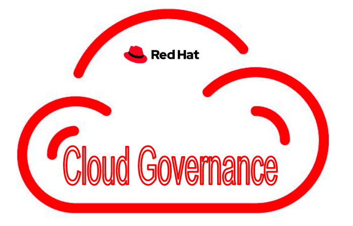
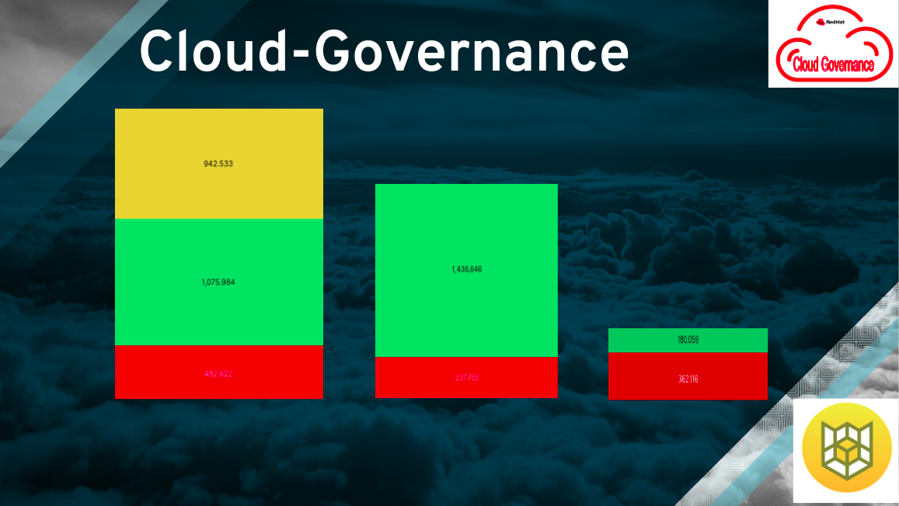
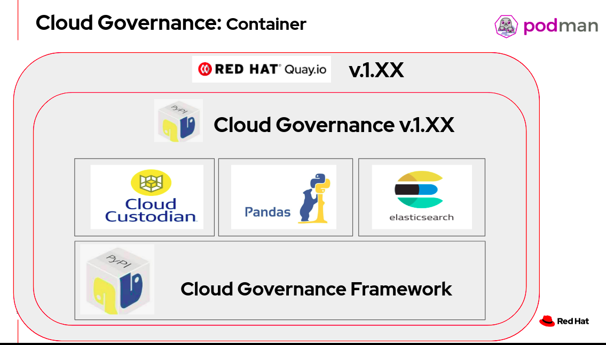

[](https://github.com/redhat-performance/cloud-governance/actions)
[](https://coveralls.io/github/redhat-performance/cloud-governance?branch=master)


<h3 align="center">Cloud Governance</h3>



This tool provides a lightweight and flexible framework for deploying cloud management policies focusing on 
cost optimize and security.

This tool support the following policies:
[policy](cloud_governance/policy)

* Real time Openshift Cluster cost, User cost
* ec2_idle: idle ec2 in last 2 days, cpu < 5% & network < 10mb [ec2_idle](cloud_governance/policy/ec2_idle.yml)
* ec2_run: running ec2 [ec2_run](cloud_governance/policy/ec2_run.yml)
* ebs_unattached: volumes that did not connect to instance, volume in available status [ebs_unattached](cloud_governance/policy/ebs_unattached.yml)
* ebs_in_use: in use volumes [ebs_in_use](cloud_governance/policy/ebs_in_use.yml)
* tag_cluster_resource: Update cluster tags by input cluster name 
* zombie_cluster_resource: Delete cluster's zombie resources
* tag_ec2_resource: tag ec2 resources (instance, volume, ami, snapshot) by instance name
* gitleaks: scan Github repository git leak (security scan)  

** You can write your own policy using [Cloud-Custodian](https://cloudcustodian.io/docs/quickstart/index.html)
   and run it (see 'custom cloud custodian policy' in [Policy workflows](#policy-workloads)).

First release: Support AWS only
 


Reference:
* The cloud-governance package is placed in [PyPi](https://pypi.org/project/cloud-governance/)
* The cloud-governance container image is placed in [Quay.io](https://quay.io/repository/ebattat/cloud-governance)



_**Table of Contents**_

<!-- TOC -->
- [Installation](#installation)
- [Configuration](#configuration)
- [Run Policy Using Podman](#run-policy-using-podman)
- [Run Policy Using Pod](#run-policy-using-pod)
- [Pytest](#pytest)
- [Post Installation](#post-installation)

<!-- /TOC -->

## Installation

#### Download cloud-governance image from quay.io
```sh
# Need to run it with root privileges
sudo podman pull quay.io/ebattat/cloud-governance
```

#### Environment variables description:

(mandatory)AWS_ACCESS_KEY_ID=$AWS_ACCESS_KEY_ID

(mandatory)AWS_SECRET_ACCESS_KEY=$AWS_SECRET_ACCESS_KEY

##### Policy name:
(mandatory)policy=ec2_idle / ec2_run / ebs_unattached / ebs_in_use / tag_cluster_resource / zombie_cluster_resource / tag_ec2_resource

##### Policy logs output
(mandatory)policy_output=s3://redhat-cloud-governance/logs

##### Cluster or instance name:
(mandatory policy:tag_cluster_resource)resource_name=ocs-test

##### Cluster or instance tags:
(mandatory policy:tag_cluster_resource)mandatory_tags="{'Owner': 'Name','Email': 'name@redhat.com','Purpose': 'test'}"

##### gitleaks
(mandatory policy: gitleaks)git_access_token=$git_access_token
(mandatory policy: gitleaks)git_repo=https://github.com/redhat-performance/cloud-governance
(optional policy: gitleaks)several_repos=yes/no (default = no)

##### Choose a specific region or all for all the regions, default : us-east-2
(optional)AWS_DEFAULT_REGION=us-east-2/all (default = us-east-2)

##### Choose dry run or not, default yes
(optional)dry_run=yes/no (default = yes)

##### Choose log level, default INFO
(optional)log_level=INFO (default = INFO)

## Configuration
#### Create a user and a bucket
* Create user with IAM [iam](iam)
* Create a logs bucket [create_bucket.sh](iam/create_bucket.sh)

## Run Policy Using Podman 
```sh
# policy=ec2_idle
sudo podman run --rm --name cloud-governance -e policy=ec2_idle -e AWS_ACCESS_KEY_ID=$AWS_ACCESS_KEY_ID -e AWS_SECRET_ACCESS_KEY=$AWS_SECRET_ACCESS_KEY -e AWS_DEFAULT_REGION=us-east-2 -e dry_run=yes -e policy_output=s3://bucket/logs -e log_level=INFO quay.io/ebattat/cloud-governance

# policy=ec2_run
sudo podman run --rm --name cloud-governance -e policy=ec2_run -e AWS_ACCESS_KEY_ID=$AWS_ACCESS_KEY_ID -e AWS_SECRET_ACCESS_KEY=$AWS_SECRET_ACCESS_KEY -e AWS_DEFAULT_REGION=us-east-2 -e dry_run=yes -e policy_output=s3://bucket/logs -e log_level=INFO quay.io/ebattat/cloud-governance

# policy=ebs_unattached
sudo podman run --rm --name cloud-governance -e policy=ebs_unattached -e AWS_ACCESS_KEY_ID=$AWS_ACCESS_KEY_ID -e AWS_SECRET_ACCESS_KEY=$AWS_SECRET_ACCESS_KEY -e AWS_DEFAULT_REGION=us-east-2 -e dry_run=yes -e policy_output=s3://bucket/logs -e log_level=INFO quay.io/ebattat/cloud-governance

# policy=ebs_in_use
sudo podman run --rm --name cloud-governance -e policy=ebs_in_use -e AWS_ACCESS_KEY_ID=$AWS_ACCESS_KEY_ID -e AWS_SECRET_ACCESS_KEY=$AWS_SECRET_ACCESS_KEY -e AWS_DEFAULT_REGION=us-east-2 -e dry_run=yes -e policy_output=s3://bucket/logs -e log_level=INFO quay.io/ebattat/cloud-governance

# policy=zombie_cluster_resource
sudo podman run --rm --name cloud-governance -e policy=zombie_cluster_resource -e AWS_ACCESS_KEY_ID=$AWS_ACCESS_KEY_ID -e AWS_SECRET_ACCESS_KEY=$AWS_SECRET_ACCESS_KEY -e AWS_DEFAULT_REGION=us-east-2 -e dry_run=yes -e resource=zombie_cluster_elastic_ip -e cluster_tag=kubernetes.io/cluster/test-pd9qq -e log_level=INFO quay.io/ebattat/cloud-governance

# policy=tag_cluster_resource
sudo podman run --rm --name cloud-governance -e policy=tag_cluster_resource -e AWS_ACCESS_KEY_ID=$AWS_ACCESS_KEY_ID -e AWS_SECRET_ACCESS_KEY=$AWS_SECRET_ACCESS_KEY -e AWS_DEFAULT_REGION=us-east-2 -e dry_run=yes -e resource_name=ocs-test -e mandatory_tags="{'Owner': 'Name','Email': 'name@redhat.com','Purpose': 'test'}" -e log_level=INFO -v /etc/localtime:/etc/localtime quay.io/ebattat/cloud-governance

# policy=tag_ec2 (no need pass AWS_ACCESS_KEY_ID/ AWS_SECRET_ACCESS_KEY using role)
sudo podman run --rm --name cloud-governance -e policy=tag_ec2 -e AWS_DEFAULT_REGION=us-east-2 -e dry_run=no -e resource_name=ocp-orch-perf -e mandatory_tags="{'Owner': 'Name','Email': 'name@redhat.com','Purpose': 'test'}" -e log_level=INFO -v /etc/localtime:/etc/localtime quay.io/ebattat/cloud-governance

# policy=gitleaks
sudo podman run --rm --name cloud-governance -e policy=gitleaks -e git_access_token=$git_access_token -e git_repo=https://github.com/redhat-performance/cloud-governance -e several_repos=no -e log_level=INFO quay.io/ebattat/cloud-governance

# custom cloud custodian policy (path for custom policy: -v /home/user/custodian_policy:/custodian_policy)
sudo podman run --rm --name cloud-governance -e policy=/custodian_policy/policy.yml -e AWS_ACCESS_KEY_ID=$AWS_ACCESS_KEY_ID -e AWS_SECRET_ACCESS_KEY=$AWS_SECRET_ACCESS_KEY -e AWS_DEFAULT_REGION=us-east-2 -e dry_run=yes -e policy_output=s3://bucket/logs -e log_level=INFO -v /home/user/custodian_policy:/custodian_policy --privileged quay.io/ebattat/cloud-governance

```

## Run Policy Using Pod

#### Run as a pod job via OpenShift

Job Pod: [cloud-governance.yaml](pod_yaml/cloud-governance.yaml)

Configmaps: [cloud_governance_configmap.yaml](pod_yaml/cloud_governance_configmap.yaml)

Quay.io Secret: [quayio_secret.sh](pod_yaml/quayio_secret.sh)

AWS Secret: [cloud_governance_secret.yaml](pod_yaml/cloud_governance_secret.yaml)

    * Need to convert secret key to base64 [run_base64.py](pod_yaml/run_base64.py)

## Pytest

##### Cloud-governance integration tests using pytest
```sh
python3 -m venv governance
source governance/bin/activate
(governance) $ python -m pip install --upgrade pip
(governance) $ pip install coverage
(governance) $ pip install pytest
(governance) $ git clone https://github.com/redhat-performance/cloud-governance
(governance) $ cd cloud-governance
(governance) $ coverage run -m pytest
(governance) $ deactivate
rm -rf *governance*
```

## Post Installation

#### Delete cloud-governance image
```sh
sudo podman rmi quay.io/ebattat/cloud-governance
```
