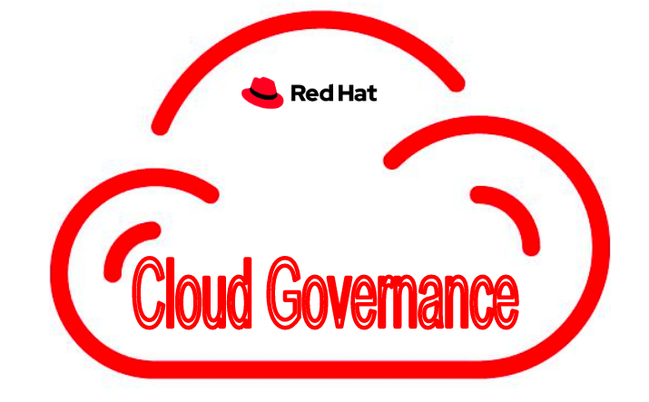

[](https://pypi.org/project/cloud-governance/)
[](https://quay.io/repository/cloud-governance/cloud-governance?tab=tags)
[](https://github.com/redhat-performance/cloud-governance/actions)[](https://coveralls.io/github/redhat-performance/cloud-governance?branch=main)
[](https://cloud-governance.readthedocs.io/en/latest/?badge=latest)
[](https://pypi.org/project/cloud-governance)
[](https://github.com/redhat-performance/cloud-governance/blob/main/LICENSE)

# Cloud Governance



## What is it?

**Cloud Governance** tool provides a lightweight and flexible framework for deploying cloud management policies focusing
on cost optimize and security.
We have implemented several pruning policies. \
When monitoring the resources, we found that most of the cost leakage is from available volumes, unused NAT gateways,
and unattached Public IPv4 addresses (Starting from February 2024, public IPv4 addresses are chargeable whether they are
used or not).

| Providers | Disks   | NatGateway | PublicIp | Snapshots | InstanceIdle | TagResources | EC2Stop | ocp_cleanup | ClusterRun | EmptyBucket | EmptyRoles |
|-----------|---------|------------|----------|-----------|--------------|--------------|---------|-------------|------------|-------------|------------|
| AWS       | &check; | &check;    | &check;  | &check;   | &check;      | &check;      | &check; | &check;     | &check;    | &check;     | &check;    |
| Azure     | &check; | &check;    | &check;  | &check;   | &check;      | &cross;      | &cross; | &cross;     | &check;    | &cross;     | &cross;    |

List of Policies:

##### [AWS Polices!](./POLICIES.md#aws-policies)

- instance_idle
- instance_run
- unattached_volume
- zombie_cluster_resource
- ip_unattached
- zombie_snapshots
- unused_nat_gateway
- s3_inactive
- empty_roles
- tag_resources
- tag_iam_user
- cost_over_usage
- cluster_run

##### [Azure Polices!](POLICIES.md)

- instance_idle
- unattached_volume
- ip_unattached
- unused_nat_gateway

##### [IBM Polices!](POLICIES.md)

- tag_baremetal
- tag_vm
- tag_resources

Check out policy summary [here!](POLICIES.md)


Reference:

* Checkout
  blog: [Optimizing cloud resource management with cloud governance](https://www.redhat.com/en/blog/optimizing-cloud-resource-management-cloud-governance)
* The cloud-governance package is placed in [PyPi](https://pypi.org/project/cloud-governance/)
* The cloud-governance container image is placed in [Quay.io](https://quay.io/repository/ebattat/cloud-governance)
* The cloud-governance readthedocs link is [ReadTheDocs](https://cloud-governance.readthedocs.io/en/latest/)

[//]: # (  ![]&#40;images/cloud_governance3.png&#41;)

_**Table of Contents**_

<!-- TOC -->

- [Installation](#installation)
- [Configuration](#environment-variables-configurations)
- [Run Policies](#run-policies)
- [Run Policy Using Pod](#run-policy-using-pod)
- [Pytest](#pytest)
- [Post Installation](#post-installation)

<!-- /TOC -->

## Installation

#### Download cloud-governance image from quay.io

```sh
podman pull quay.io/cloud-governance/cloud-governance
```

#### Environment variables configurations:

| Key                            | Value    | Description                                                                 |
|--------------------------------|----------|:----------------------------------------------------------------------------|
| AWS_ACCESS_KEY_ID              | required | AWS access key                                                              |
| AWS_SECRET_ACCESS_KEY          | required | AWS Secret key                                                              |
| AWS_DEFAULT_REGION             | required | AWS Region, default set to us-east-2                                        |
| BUCKET_NAME                    | optional | Cloud bucket Name, to store data                                            |
| policy                         | required | check [here](POLICIES.md) for policies list                                 |
| dry_run                        | optional | default set to "yes", supported only two: yes/ no                           |
| log_level                      | optional | default set to INFO                                                         |
| LDAP_HOST_NAME                 | optional | ldap hostnames                                                              |
| es_host                        | optional | Elasticsearch Host                                                          |
| es_port                        | optional | Elasticsearch Port                                                          |
| es_index                       | optional | Elasticsearch Index, to push the data. default to cloud-governance-es-index |
| GOOGLE_APPLICATION_CREDENTIALS | optional | GCP creds, to access google resources. i.e Sheets, Docs                     |
| AZURE_CLIENT_SECRET            | required | Azure Client Secret                                                         |
| AZURE_TENANT_ID                |          | Azure Tenant Id                                                             |
| AZURE_ACCOUNT_ID               |          | Azure Account Id                                                            |
| AZURE_CLIENT_ID                |          | Azure Client Id                                                             |
| GCP_DATABASE_NAME              |          | GCP BigQuery database name, used to generate cost reports                   |
| GCP_DATABASE_TABLE_NAME        |          | GCP BigQuery TableName, used to generate cost reports                       |
| IBM_API_USERNAME               |          | IBM Account Username                                                        |
| IBM_API_KEY                    |          | IBM Account Classic Infrastructure key                                      |
| IBM_CLOUD_API_KEY              |          | IBM Cloud API Key                                                           |
| IBM_CUSTOM_TAGS_LIST           |          | pass string with separated with comma. i.e: "cost-center: test, env: test"  |

### AWS Configuration

Create IAM User with Read/Delete Permissions and create S3 bucket.

- Follow the instructions [README.md](iam/clouds/aws/CloudGovernanceInfra/README.md).

### IBM Configuration

* Create classic infrastructure API key
* Create IBM CLOUD API key to use tag_resources policy

## Run Policies

## AWS

- Passing environment variables

```shell
  podman run --rm --name cloud-governance \
  -e policy="zombie_cluster_resource" \
  -e AWS_ACCESS_KEY_ID="$AWS_ACCESS_KEY_ID" \
  -e AWS_SECRET_ACCESS_KEY="$AWS_SECRET_ACCESS_KEY" \
  -e AWS_DEFAULT_REGION="us-east-2" \
  -e dry_run="yes"  \
   "quay.io/cloud-governance/cloud-governance"
```

- Using involvement file config
- Create env.yaml file, and mount it to /tmp/env.yaml else mount to anypath and pass env DEFAULT_CONFIG_PATH where you
  mounted

```yaml
AWS_ACCESS_KEY_ID: ""
AWS_SECRET_ACCESS_KEY: ""
AWS_DEFAULT_REGION: "us-east-2"
policy: "zombie_cluster_resource"
dry_run: "yes"
es_host: ""
es_port: ""
es_index: ""
```

```shell
  podman run --rm --name cloud-governance \
  -v "env.yaml":"/tmp/env.yaml" \
  --net="host" \
   "quay.io/cloud-governance/cloud-governance"
```

## Run Policy Using Pod

#### Run as a pod job via OpenShift

Job Pod: [cloud-governance.yaml](pod_yaml/cloud-governance.yaml)

Configmaps: [cloud_governance_configmap.yaml](pod_yaml/cloud_governance_configmap.yaml)

Quay.io Secret: [quayio_secret.sh](pod_yaml/quayio_secret.sh)

AWS Secret: [cloud_governance_secret.yaml](pod_yaml/cloud_governance_secret.yaml)

    * Need to convert secret key to base64 [run_base64.py](pod_yaml/run_base64.py)

## Pytest

##### Cloud-governance integration tests using pytest

```sh
python3 -m venv governance
source governance/bin/activate
(governance) $ python -m pip install --upgrade pip
(governance) $ pip install coverage
(governance) $ pip install pytest
(governance) $ git clone https://github.com/redhat-performance/cloud-governance
(governance) $ cd cloud-governance
(governance) $ coverage run -m pytest
(governance) $ deactivate
rm -rf *governance*
```

## Post Installation

#### Delete cloud-governance image

```sh
sudo podman rmi quay.io/cloud-governance/cloud-governance
```
