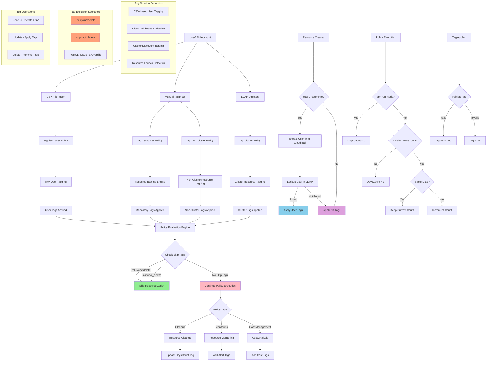

# Tags Lifecycle in Cloud Governance

This diagram shows how tags are created, managed, and used throughout the cloud governance system across different scenarios.

## Tag Lifecycle Scenarios

### 1. User and IAM Tagging (`tag_iam_user`)
- **Source**: CSV files with user data
- **Operations**: read/update/delete
- **Process**:
  - Read all users into CSV
  - Manual tag updates in CSV
  - Apply tags to IAM users
  - Sync with LDAP directory

### 2. Resource Tagging (`tag_resources`)
- **Source**: Mandatory tags configuration
- **Scope**: All cluster and non-cluster resources
- **Limitation**: Resources created in last 90 days
- **Process**:
  - Identify untagged resources
  - Apply mandatory tags
  - User attribution via CloudTrail

### 3. Cluster Resource Tagging (`tag_cluster`)
- **Source**: Cluster discovery and user input
- **Process**:
  - Scan security groups for cluster patterns
  - Find cluster stamp keys (e.g., `kubernetes.io/cluster/test-jlhpd`)
  - Apply cluster-specific tags
  - Merge with existing tags

### 4. Non-Cluster Resource Tagging (`tag_non_cluster`)
- **Source**: Instance names, CloudTrail, IAM user tags
- **Process**:
  - Extract username from launch time
  - Lookup user in LDAP
  - Apply user tags or NA tags
  - Update instance and associated resources

## Tag-Based Policy Exclusion

### Skip Mechanisms
- **`Policy=notdelete`**: Resource skipped from all cleanup actions
- **`skip=not_delete`**: Alternative skip tag format
- **Case Insensitive**: Tags normalized (remove `-`, `_`, uppercase)

### DaysCount Tag Logic
- **Dry Run Mode**: Always sets DaysCount = 0
- **Live Mode**: Increments counter daily
- **Format**: `date@count` (e.g., `2023-12-25@3`)
- **Action Trigger**: When count reaches `DAYS_TO_TAKE_ACTION`

## Tag Operations Flow

1. **Read Operation**: Generate CSV with current tags
2. **Update Operation**: Apply new tags from configuration
3. **Delete Operation**: Remove specified tags
4. **Validation**: Ensure tag compliance and format

## Integration Points

- **CloudTrail**: Resource creation attribution
- **LDAP**: User information lookup
- **IAM**: User tag synchronization
- **ElasticSearch**: Tag-based reporting
- **S3**: Tag data storage and backup
