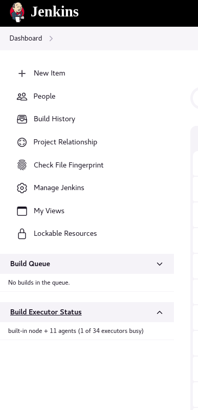
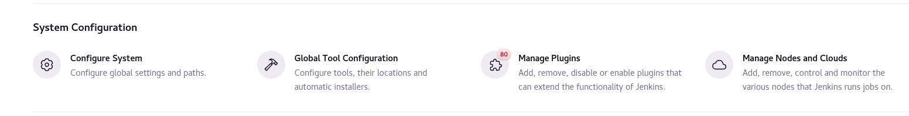
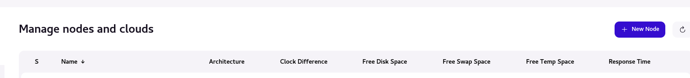
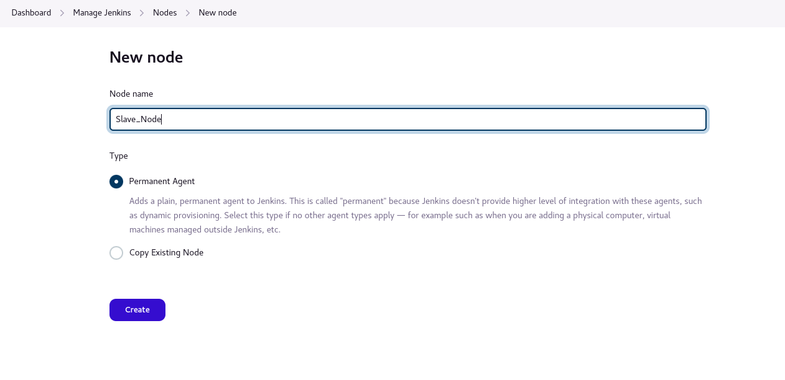
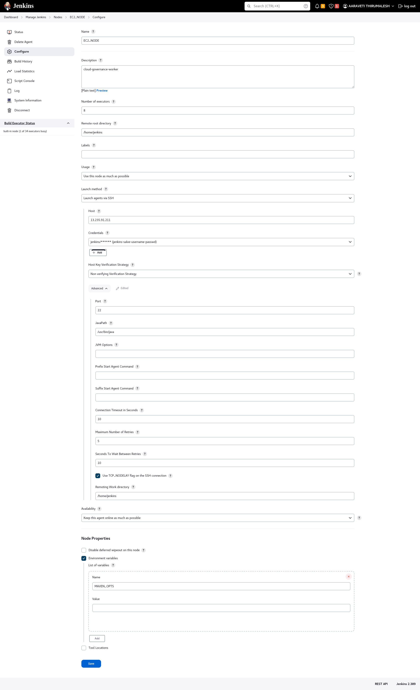
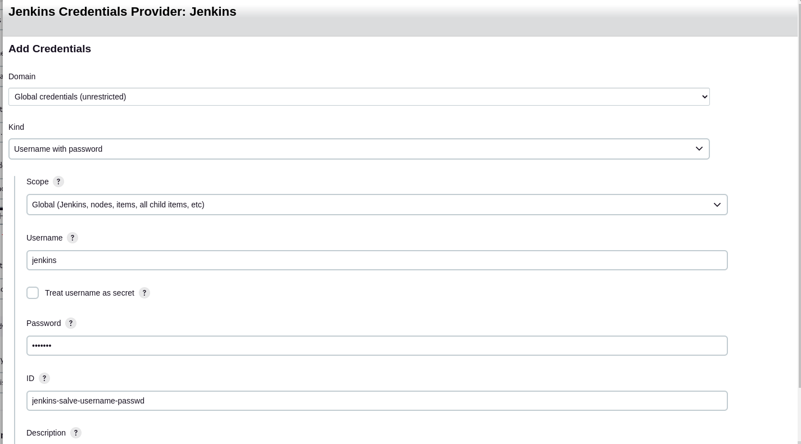

## Configure Jenkins slave to master

### Install Java-11 based on OS
rhel8
```commandline
sudo yum install java-11-openjdk-devel
```
amazon-linux
```commandline
yum install java-11-amazon-corretto-devel.x86_64
```

### Install Docker on CentOS/ Fedora
Centos: https://docs.docker.com/engine/install/centos/
Fedora: https://docs.docker.com/engine/install/fedora/

### Installing on Fedora
```
sudo dnf -y install dnf-plugins-core
sudo dnf config-manager --add-repo https://download.docker.com/linux/fedora/docker-ce.repo
sudo dnf install docker-ce docker-ce-cli containerd.io docker-buildx-plugin docker-compose-plugin
sudo systemctl start docker
```

### Add Jenkins user
```commandline
useradd jenkins -U -s /bin/bash
```
Set password
```commandline
passwd jenkins
```
ex: test123

### Add Jenkins to the sudoers file

$ vi /etc/sudoers
```commandline
jenkins     ALL=(ALL)       NOPASSWD: ALL
```

### Create a Key-Pair
```commandline
ssh-keygen
cat .ssh/id_rsa.pub >> .ssh/authorized_keys
```

### Connect to Jenkins Master with your node

Open Jenkins master
1. Manage Jenkins

2. Manage Nodes and Clouds

3. New Node

4. Add details

5. Configure Node


Click on add to add jenkins user and private_key



Give permissions to **jenkins** user to run docker daemon
```commandline
sudo chown jenkins:jenkins /var/run/docker.sock
```
Check docker working from jenkins user
```commandline
sudo su - jenkins
docker images
```

Now you are ready to run the cloud-governance policies

### Run the ElasticSearch, Grafana, Kibana as a container within the same network

#### Using the docker engine
```commandline
# detached mode
docker-compose -f docker_compose_file_path up -d
# down the containers
docker-compose -f docker_compose_file_path down
```

#### Using the podman

create elasticsearch & grafana local persistence Directories

Create and Allow Permissions
```commandline
CLOUD_GOVERNANCE_PATH=""
mkdir -p $CLOUD_GOVERNANCE_PATH/grafana
mkdir -p $CLOUD_GOVERNANCE_PATH/elasticsearch

# Give permissions
chmod 777 -R $CLOUD_GOVERNANCE_PATH/grafana
chmod 777 $CLOUD_GOVERNANCE_PATH/elasticsearch
```

```commandline
# Run the containers in pods
podman play kube file.yml
# Delete the containers in pods
podman play kube --down file.yml
```


## How to create a new user and s3 bucket on AWS

Goto IAM Services to create policy and user

1. Create Policy named CloudGovernancePolicy
   2. Use [CloudGovernanceDeletePolicy.json](..%2Fiam%2Fclouds%2Faws%2FCloudGovernanceDeletePolicy.json) to create the policy
2. Create cloud-governance-user
3. Attach the CloudGovernancePolicy to cloud-governance-user.
3. Create s3 bucket: cloud-governance-*


#### How to pass aws credentials to jenkins job

1. Create the json file with below format and save it in local env.
2. Create/Update the jenkins file credential


```commandline
{
"account1": {
   "AWS_ACCESS_KEY_ID": "acces_key",
   "AWS_SECRET_ACCESS_KEY" : "acees_secret",
   "BUCKET" : "bucket_name"
 },
"account2": {
   "AWS_ACCESS_KEY_ID": "acces_key",
   "AWS_SECRET_ACCESS_KEY" : "acees_secret",
   "BUCKET" : "bucket_name"
 }
}
```
